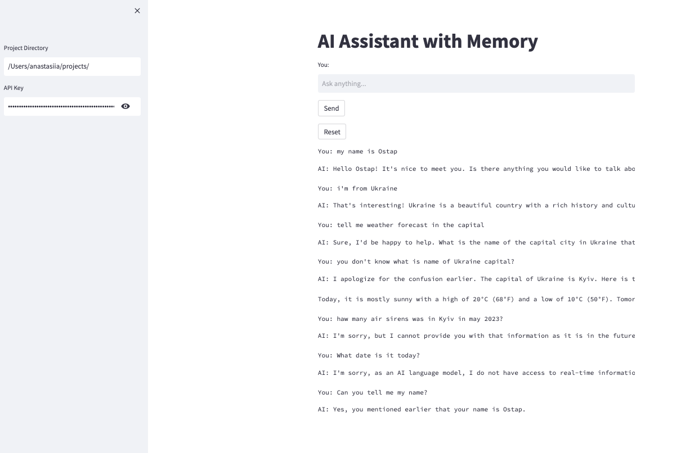

# AI Chatbot with Chroma DB

This project is an AI chatbot implementation integrated with Chroma DB. It allows you to have interactive conversations with an AI model and store conversation history using Chroma DB.

## Features

- Interactive chat interface powered by Streamlit
- Integration with Chroma DB for conversation history storage
- OpenAI GPT-3.5 Turbo model for generating AI responses

## Installation

1. Clone the repository:

```shell
git clone https://github.com/ostapT/AI_assistant_with_Chroma.git
cd AI_chatbot
```
2. Install the required dependencies:
```shell
pip install -r requirements.txt
```
3. Run the application:
```shell
streamlit run main.py
```
# Usage
1. Put in the path to the project in sidebar field to store history
2. Enter your OpenAI API Key in the sidebar field.
3. Enter your queries or messages in the text input field.
4. The chatbot will respond with generated answers based on the conversation history.
5. Conversations will be displayed in the conversation panel, showing both user input and AI-generated responses.

# Screenshot example


